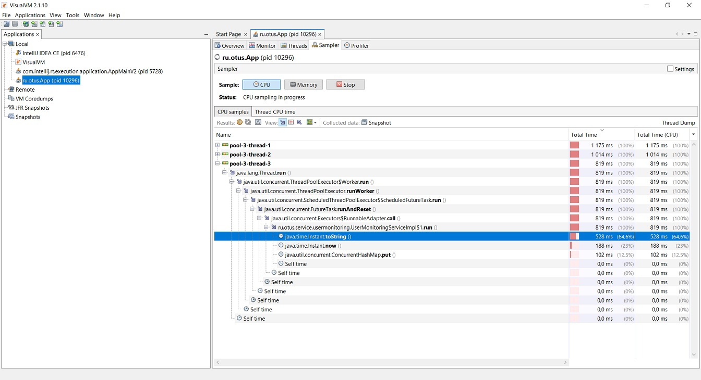
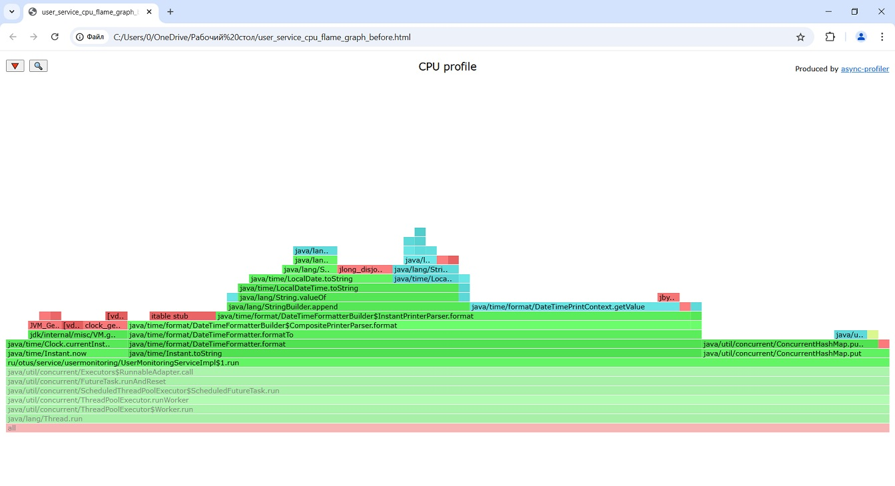
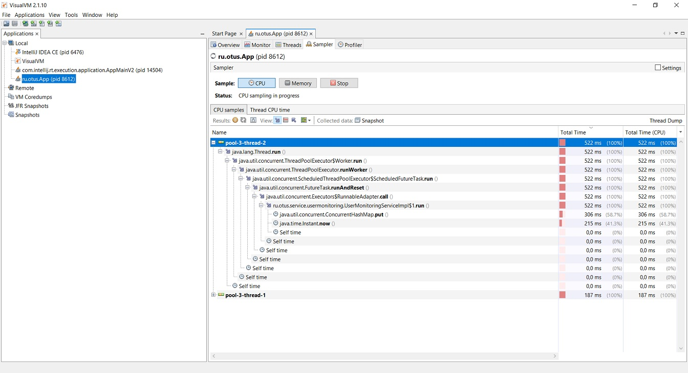
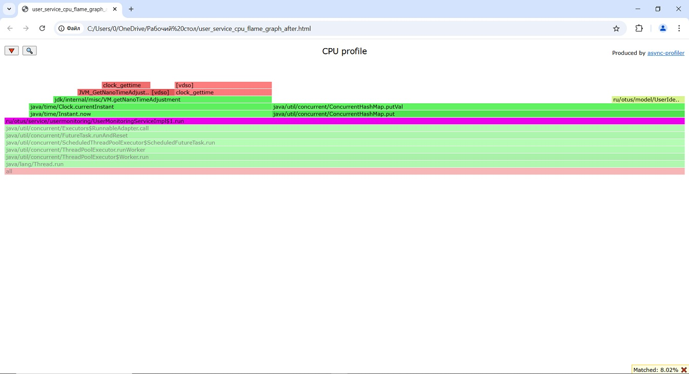

# Сэмплирование и профилирование

Проведен анализ работы сервиса регистрации пользователей с точки зрения времени CPU, с особым вниманием к процессам мониторинга.
Для анализа применялось сэмплирование и профилирование с использованием Visual VM и Async Profiler.

При добавлении нового пользователя запускается процесс мониторинга для этого пользователя, который завершается только после удаления этого пользователя.
Процесс мониторинга пользователя запускается раз в 1 секунду и записывает в кэш время мониторинга в формате timestamp с внутренним идентификатором пользователя в качестве ключа.
Данные кэша используются для отчета о мониторинге по всем пользователям.

## Подготовительные работы
С целью наргузки сервиса мониторинга и заполнения кэша было зарегистрировано 10000 тестовых пользователей, 
соответственно, было запущено 10000 процессов мониторинга.

## Анализ

Сэмплирование

Профилирование

## Вывод

Обнаружено потребление CPU процессом преобразования java.time.Instant в String, более сушественное чем у остальных процессов, запускаемых перед записью данных мониторинга в кэш.
Следует рассмотреть целесообразность такого преобразования и хранения timestamp в кэше в виде String.

## Решение
Установлено, что Instant можно использовать в исходном виде как для отчета о мониторинге, так и для хранения в кэше.
Были внесены изменения в код - переписаны поля и методы сервиса мониторинга и прочие классы, использовавшие время мониторинга пользователя в формате String.

## Результат

Повторное сэмплирование и профилирование показало снижение потребления CPU процессами мониторинга.
Отчеты наглядно показывают результаты исключения процесса преобразования Instant в String перед записью в кэш.

Сэмплирование

Профилирование

